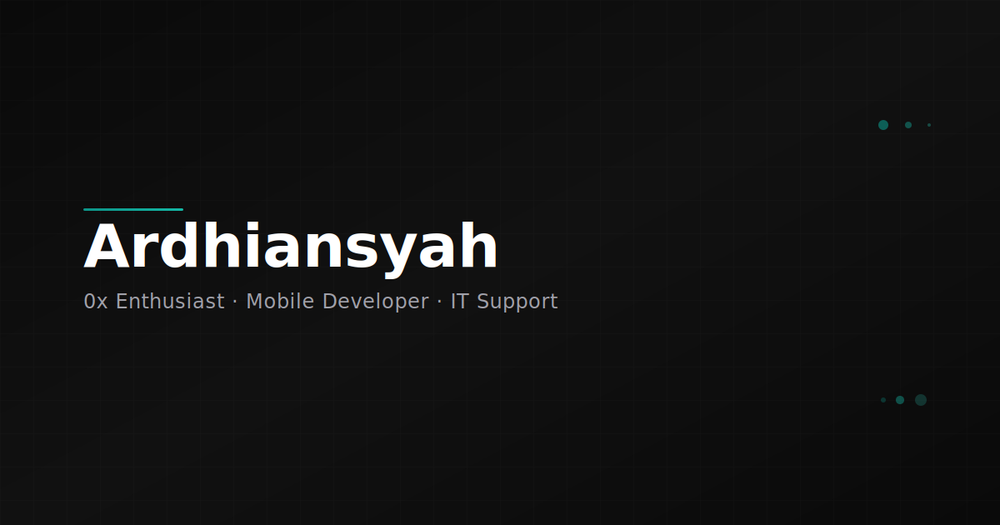

```
                                                     █████╗ ██████╗
                                                    ██╔══██╗██╔══██╗
                                                    ███████║██████╔╝
                                                    ██╔══██║██╔══██╗
                                                    ██║  ██║██║  ██║
                                                    ╚═╝  ╚═╝╚═╝  ╚═╝
```

# AR Portfolio — Creative Developer Portfolio

<p align="center">
  
  
  
  
  
  
  
</p>

<p align="center">
  <b>Live:</b> <a href="https://ar-portfolio-dusky.vercel.app">ar-portfolio-dusky.vercel.app</a> ·
  <b>Author:</b> <a href="https://github.com/whyuardi">@whyuardi</a>
</p>

---

A premium creative developer portfolio by **Ardhiansyah** — built with **Next.js 16**, **Three.js**, and **Framer Motion**. Features a glass-dodecahedron 3D background, Spline interactive 3D blade, per-section WebGL scenes with bloom effects, particle systems, and mouse-reactive floating geometries. Dark, editorial-brutalist aesthetic with oversized typography and smooth scroll-triggered animations.

---

## Screenshot

<p align="center">
  
  <br>
  <em>The portfolio hero section with 3D glass dodecahedron background and floating gems.</em>
</p>

---

## Features

| # | Feature | Description |
|---|---------|-------------|
| 🎨 | **3D WebGL Background** | Glass dodecahedron with orbiting fragments, floating light orbs, and a subtle ring — dims on scroll |
| 🌀 | **Spline 3D Blade** | Interactive Spline 3D scene loaded via `spline-viewer` custom element |
| ✨ | **Per-Section Scenes** | Unique WebGL environments for Hero, Projects, Experience, Tech Stack, and Contact — each with bloom, particles, and colored lighting |
| 🖱️ | **Mouse-Reactive Cursor Orb** | A glowing sphere follows the cursor in 3D space using `THREE.MathUtils.lerp` for smooth tracking |
| ⏳ | **Preloader** | Animated canvas-preloader with rotating diagonal lines, geometric AR logo, and simulated loading progress |
| 🧭 | **Side Navigation** | Fixed right-rail nav with diamond-shaped section indicators, IntersectionObserver-driven active state, and smooth scroll |
| 📊 | **Scroll Indicator** | Progress bar that fills as you scroll through the page |
| 🔗 | **Intersection Observer** | Two independent observers: one for side-nav highlighting, one for the running section index counter |
| 🎞️ | **Section Reveal Animations** | CSS animation-driven reveal wrappers with configurable delay for staggered content entry |
| 🏗️ | **Projects Showcase** | 6 numbered project rows with role, description, tags, GitHub, and live links |
| 💼 | **Experience Timeline** | Career history with period, role, company, type badge, and description |
| 🧰 | **Tech Stack Grid** | Categorized skills in a monospace grid (Languages, Frontend, Backend, Tools) |
| 📞 | **Contact Section** | "Let's build something." CTA with direct LinkedIn link |
| 🏃 | **Marquee Track** | Horizontal scrolling tech ticker with duplicate seamless loop |
| 🔠 | **Editorial Typography** | Oversized headings, Cormorant Garamond serif display font, Inter sans-serif body |
| 🌙 | **Dark Theme** | Deep charcoal background (`#08080A`), warm off-white text (`#F8F7F2`), purple/teal accent palette |

---

## Tech Stack

| Layer | Technology |
|-------|------------|
| **Framework** | [Next.js 16](https://nextjs.org) (App Router) |
| **UI Library** | [React 19](https://react.dev) |
| **Language** | [TypeScript 5](https://typescriptlang.org) |
| **3D Engine** | [Three.js 0.184](https://threejs.org) |
| **React 3D** | [@react-three/fiber 9.6](https://docs.pmnd.rs/react-three-fiber) · [@react-three/drei 10.7](https://github.com/pmndrs/drei) · [@react-three/postprocessing 3.0](https://github.com/pmndrs/react-postprocessing) |
| **Spline** | [@splinetool/react-spline 4.1](https://spline.design) · [@splinetool/runtime 1.12](https://github.com/splinetool/runtime) |
| **Animation** | [Framer Motion 12](https://motion.dev) / [Motion 12](https://motion.dev) |
| **Styling** | [Tailwind CSS 4](https://tailwindcss.com) |
| **Icons** | [Phosphor Icons](https://phosphoricons.com) (`@phosphor-icons/react`) |
| **Fonts** | [Geist](https://vercel.com/font) (Vercel) · [Inter](https://rsms.me/inter/) · [Cormorant Garamond](https://fonts.google.com/specimen/Cormorant+Garamond) |
| **Testing** | [Playwright](https://playwright.dev) |
| **Package Manager** | pnpm |
| **Deployment** | [Vercel](https://vercel.com) |

---

## Getting Started

### Prerequisites

- **Node.js** 20.x or later
- **pnpm** (recommended) — `npm install -g pnpm`

### Installation

```bash
# Clone the repository
git clone https://github.com/whyuardi/ar-portfolio.git
cd ar-portfolio

# Install dependencies
pnpm install

# Start development server
pnpm dev
```

Open [http://localhost:3000](http://localhost:3000) in your browser. The page auto-updates as you edit files in `src/`.

### Scripts

| Command | Description |
|---------|-------------|
| `pnpm dev` | Start development server |
| `pnpm build` | Production build |
| `pnpm start` | Start production server |
| `pnpm lint` | Run ESLint |

---

## Project Structure

```
ar-portfolio/
├── public/
│   ├── og.png              # Open Graph preview image
│   ├── favicon.ico          # Favicon
│   └── *.svg                # Static SVGs
├── src/
│   ├── app/
│   │   ├── fonts/           # Geist font files (woff2)
│   │   ├── globals.css      # Global styles + Tailwind
│   │   ├── layout.tsx       # Root layout, fonts, metadata
│   │   ├── page.tsx         # Home page — all sections
│   │   ├── robots.ts        # Robots configuration
│   │   └── sitemap.ts       # Sitemap generation
│   ├── components/
│   │   ├── 3d/
│   │   │   ├── ARBlade.tsx  # Spline 3D viewer wrapper
│   │   │   └── MountainScene.tsx
│   │   ├── CanvasLogo.tsx
│   │   ├── Contact.tsx
│   │   ├── Experience.tsx
│   │   ├── Footer.tsx
│   │   ├── FullCanvas.tsx
│   │   ├── Header.tsx
│   │   ├── Hero.tsx
│   │   ├── Marquee.tsx      # Infinite-scroll tech ticker
│   │   ├── MinimalHeader.tsx
│   │   ├── ParticleNetwork.tsx
│   │   ├── Preloader.tsx    # Animated canvas preloader
│   │   ├── Projects.tsx
│   │   ├── ScrollDots.tsx
│   │   ├── ScrollIndicator.tsx  # Progress bar
│   │   ├── SectionReveal.tsx    # Scroll reveal wrapper
│   │   ├── SectionScenes.tsx    # Per-section 3D environments
│   │   ├── SideNav.tsx      # Right-rail navigation
│   │   ├── TechStack.tsx
│   │   ├── ThreeBackground.tsx
│   │   ├── TiltCard.tsx
│   │   └── WebGLBackground.tsx  # Glass dodecahedron scene
│   └── ...
├── next.config.ts           # Next.js configuration
├── tailwind.config.ts       # Tailwind CSS configuration
├── tsconfig.json            # TypeScript configuration
├── pnpm-lock.yaml
└── package.json
```

---

## Customization Guide

### Change Personal Info

Edit the constants in `src/app/page.tsx`:

- **Hero section** — name, role, description, stats
- **Projects** — `projects` array (title, role, description, techs, links)
- **Experience** — `experience` array (period, role, company, description)
- **Tech Stack** — `skillGroups` array (categories and items)
- **Contact** — LinkedIn URL, email in footer

### Update Metadata

Edit `src/app/layout.tsx`:

```ts
export const metadata: Metadata = {
  title: "Your Name — Creative Developer",
  description: "Your description here",
  // ...
};
```

### Replace Spline Scene

In `src/components/3d/ARBlade.tsx`, update the Spline URL:

```ts
viewer.setAttribute(
  'url',
  'https://prod.spline.design/YOUR_SCENE_ID/scene.splinecode'
)
```

### Modify 3D Scenes

Each section has its own 3D environment in `src/components/SectionScenes.tsx`:

- **HeroScene** — Floating gems, wobble shapes, rotating rings, particles, bloom
- **ProjectsScene** — Darker palette, purple/teal gems
- **ExperienceScene** — Amber accent, warm lighting
- **TechStackScene** — Cyan/purple gems, cyan particles
- **ContactScene** — Teal/pink accent, rotating ring

Adjust colors, scale, count, or intensity per scene. The background glass dodecahedron lives in `WebGLBackground.tsx`.

### Color Palette

Defined in `globals.css` and `SectionScenes.tsx`:

| Token | Color | Usage |
|-------|-------|-------|
| `--bg` | `#08080A` | Background |
| `--fg` | `#F8F7F2` | Text |
| Accent | `#6C63FF` / `#8B7FFF` | Purple glow |
| Scene 1 | `#14d9c4` | Teal (hero) |
| Scene 2 | `#a855f7` | Purple (projects) |
| Scene 3 | `#f59e0b` | Amber (experience) |
| Scene 4 | `#06b6d4` | Cyan (tech stack) |
| Scene 5 | `#ec4899` | Pink (contact) |

### Section IDs & Nav

The side navigation in `SideNav.tsx` uses section IDs mapped to labels. If you add or rename sections, update both the `sections` array in `SideNav.tsx` and the `map` in `RunningIndex()` within `page.tsx`.

---

## Deployment

The project is optimized for **Vercel** with zero configuration.

### Deploy to Vercel

```bash
# Install Vercel CLI
pnpm add -g vercel

# Deploy
vercel

# Production
vercel --prod
```

Or connect your GitHub repository directly via the [Vercel Dashboard](https://vercel.com/new).

### Build Locally

```bash
pnpm build
pnpm start
```

---

## License

**MIT** — see [LICENSE](./LICENSE) for details.

---

<p align="center">
  Built with <a href="https://nextjs.org">Next.js 16</a>, <a href="https://threejs.org">Three.js</a>, and <a href="https://motion.dev">Framer Motion</a>.<br>
  Designed & developed by <a href="https://github.com/whyuardi">Ardhiansyah</a>.
</p>
